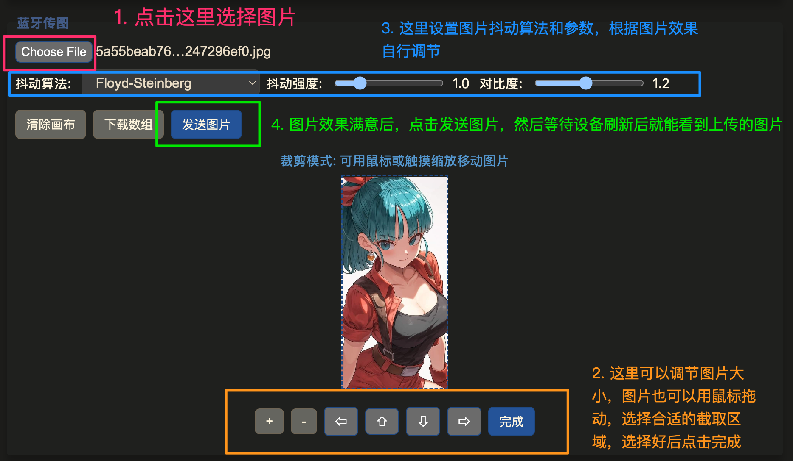

## 墨水屏日历设置

注意：本工具仅限部分2.13寸和2.9寸阿里价签使用, 其他尺寸价签设置请访问原作者项目[Github](https://github.com/tsl0922/EPD-nRF5)

---

### 支持浏览器：
- 电脑: Chrome/Edge
- Android: Chrome/Edge
- iOS: Bluefy 浏览器

### 使用方法

#### 功能概览

**说明:**
 1. 访问网址: https://breeze4dev.github.io/epd-setting
 2. 连接设备
 3. 用于设置日历模式（自动切换到今日）
 4. 用于传图到设备
 5. 用于设置图片抖动算法、参数
 6. 用于发送图片到设备

 #### 具体操作图解如下:

* 连接设备

    

* 模式选择

    

* 传图功能

    

* 添加文本和笔画功能

    

